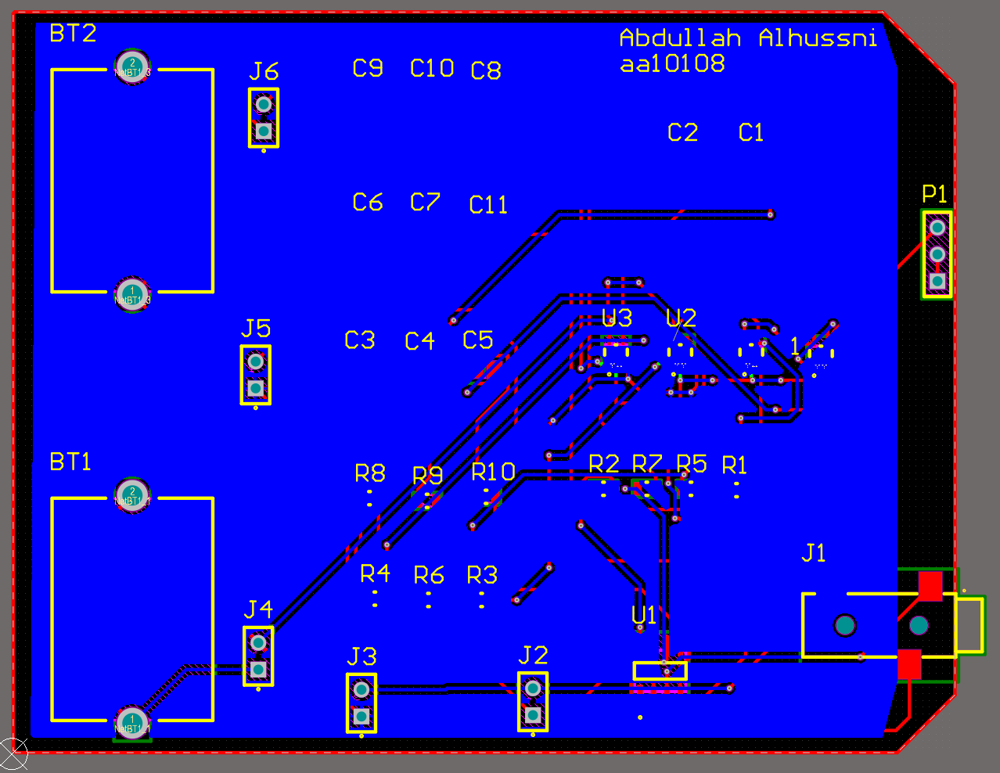

# ECG-Heart-Monitor
ECG Heart Monitor, for my ENGR-UH 3611 Electronics class

An ECG (Electrocardiogram) circuit works by detecting and amplifying the tiny electrical signals generated by the heart as it beats. This project focuses on the ECG Circuit part.

The files include the Altium project and Gerber files.

The directory watch_version includes a design of a wearable version of the ECG circuit.

